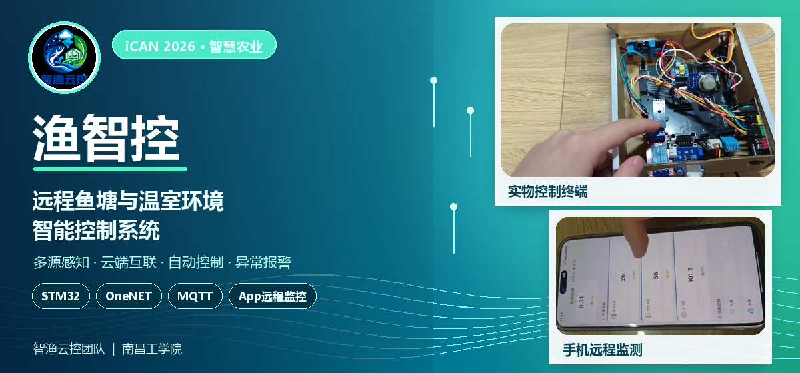
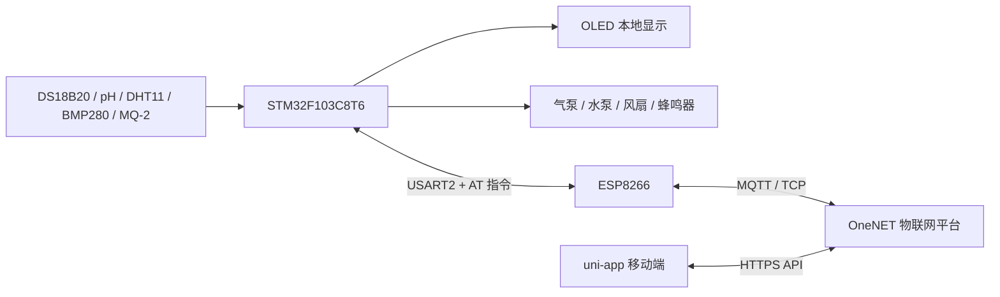

# 渔智控：智慧鱼塘环境监测与远程控制系统



基于 **STM32F103C8T6、ESP8266、OneNET 和 uni-app** 实现的智慧鱼塘监测与控制原型。系统采集水温、pH、空气温湿度、大气压和空气质量等数据，通过 MQTT 上传至 OneNET，并支持 App 远程查看、设备控制、阈值设置、自动控制与异常报警。

> 本项目为物联网软硬件综合实践作品，重点展示从传感器采集、嵌入式控制、云端通信到移动端交互的完整链路。

## 项目亮点

- **端—云—App 闭环**：STM32 采集与控制，ESP8266 联网，OneNET 负责设备接入，uni-app 提供移动端监控与控制。
- **多参数监测**：监测水温、pH、空气温湿度、大气压和空气质量，并结合水温与气压估算饱和溶解氧。
- **自动与手动双模式**：既能根据阈值自动控制气泵、水泵和风扇，也能通过 App 远程切换设备状态。
- **远程参数调整**：App 可调节溶解氧、pH、水温、气温和烟雾浓度等控制阈值。
- **本地与远程报警**：异常时驱动蜂鸣器，并在 App 中显示报警状态、弹出提示和触发振动。
- **模块化固件结构**：传感器、执行器、显示、网络和协议代码按模块组织，方便调试与扩展。

## 系统架构



数据链路如下：

1. STM32 周期采集传感器数据并执行自动控制与报警判断。
2. ESP8266 通过 Wi-Fi 连接 OneNET，固件使用 MQTT 上报属性并订阅控制主题。
3. App 通过 OneNET API 定时获取设备属性，并下发设备控制与阈值设置指令。
4. STM32 解析云端 JSON 指令，控制执行器并回复执行结果。

## 主要功能

### 数据采集与显示

- DS18B20：水温采集。
- pH 传感器：水体酸碱度采集。
- DHT11：空气温度、湿度采集。
- BMP280：大气压采集。
- MQ-2：烟雾/空气质量模拟量采集。
- OLED：轮播显示水质参数、环境参数和设备状态。

### 自动控制

| 判断条件 | 自动执行动作 |
| --- | --- |
| 溶解氧估算值低于下限 | 开启气泵增氧 |
| 溶解氧估算值达到上限 | 关闭气泵 |
| 水温达到高温阈值 | 开启水泵循环 |
| 水温低于高温阈值 | 关闭水泵 |
| 气温达到高温阈值或烟雾超标 | 风扇以 80% 速度运行 |
| 气温达到 42 ℃ | 风扇全速运行 |
| 气温和烟雾恢复正常 | 关闭风扇 |

### App 远程功能

- 查看水温、溶解氧估算值、pH、空气温湿度、大气压和空气质量。
- 控制气泵、水泵和风扇开关，并调节风扇转速。
- 切换自动控制与手动控制模式。
- 设置烟雾、溶解氧、pH、水温和气温阈值。
- 显示溶解氧、pH、水温及空气质量异常状态。
- 每 3 秒轮询一次 OneNET 设备属性；首次检测到报警时提示并振动。

## 硬件组成与接口

| 模块 | STM32 接口 | 用途 |
| --- | --- | --- |
| STM32F103C8T6 | — | 系统主控 |
| DS18B20 | PA4 | 水温采集 |
| MQ-2 | PA0 / ADC | 烟雾与空气质量采集 |
| pH 传感器 | PA1 / ADC | pH 采集 |
| DHT11 | PB8 | 空气温湿度采集 |
| BMP280 | PB0、PB1 / I²C | 大气压采集 |
| ESP8266 | PA2、PA3 / USART2 | Wi-Fi 与 OneNET 通信 |
| OLED | PB10、PB11 / I²C | 本地数据显示 |
| 气泵 | PA9 / GPIO | 增氧控制 |
| 水泵继电器 | PA10 / GPIO | 水循环控制 |
| 风扇 | PA8 / TIM1 PWM | 通风与调速 |
| 蜂鸣器 | PB9 / GPIO | 本地异常报警 |

硬件原理图：[查看原理图 PDF](./hardware/原理图截图.pdf)

## 技术栈

| 部分 | 技术 |
| --- | --- |
| 嵌入式固件 | C、STM32F10x 标准外设库 V3.5.0、Keil MDK 5 |
| 硬件通信 | GPIO、ADC、I²C、USART、PWM、单总线 |
| 网络通信 | ESP8266 AT 指令、TCP、MQTT |
| 云平台 | OneNET 物联网平台、物模型、属性上报与属性设置 |
| 数据处理 | cJSON、Base64、HMAC-SHA1 |
| 移动端 | uni-app、Vue、HBuilderX、OneNET HTTPS API |

## 仓库结构

```text
smart-fishpond-monitor/
├─ firmware/
│  └─ 硬件的源码/             # STM32 Keil 工程、驱动与 OneNET 通信代码
├─ app/
│  └─ APP的源码/              # uni-app 移动端源码
├─ hardware/
│  └─ 原理图截图.pdf           # 硬件原理图
├─ images/                    # 项目封面与展示图片
├─ .gitignore                 # 编译产物、私密配置等忽略规则
└─ README.md
```

## 快速开始

### 1. 准备开发环境

- Keil MDK 5，并安装 STM32F1 系列器件支持包。
- HBuilderX，用于导入和运行 uni-app 项目。
- OneNET 物联网平台产品、设备及物模型。
- STM32F103C8T6、ESP8266 和对应传感器/执行器硬件。

### 2. 配置并烧录 STM32 固件

1. 打开 `firmware/硬件的源码/Device/esp8266.c`，搜索 `ESP8266_WIFI_INFO`，填写本地 Wi-Fi 名称和密码。
2. 打开 `firmware/硬件的源码/OneNet/onenet.c`，填写以下本地参数：

   ```c
   #define PROID       "YOUR_PRODUCT_ID"
   #define ACCESS_KEY  "YOUR_ACCESS_KEY"
   #define DEVICE_NAME "YOUR_DEVICE_NAME"
   ```

3. 使用 Keil 打开 `firmware/硬件的源码/project.uvprojx`。
4. 确认目标芯片为 STM32F103C8T6，编译后通过下载器烧录。
5. 如需调试，可通过 USART1 查看 115200 波特率的运行日志。

### 3. 配置并运行 App

1. 使用 HBuilderX 导入 `app/APP的源码`。
2. 打开 `pages/detail/detail.vue`，查找并在本地替换：
   - `YOUR_PRODUCT_ID`
   - `YOUR_DEVICE_NAME`
   - `YOUR_ACCESS_KEY`
3. 确认 App 中的属性 ID 与 OneNET 物模型一致。
4. 连接 Android 设备或模拟器，通过 HBuilderX 运行项目。

<details>
<summary>OneNET 物模型属性 ID</summary>

| 分类 | 属性 ID | 类型/说明 |
| --- | --- | --- |
| 传感器 | `water_temp` | 水温，数值 |
| 传感器 | `do_value` | 溶解氧估算值，数值 |
| 传感器 | `ph_value` | pH，数值 |
| 传感器 | `air_temp` | 空气温度，整数 |
| 传感器 | `air_humi` | 空气湿度，整数 |
| 传感器 | `pressure_kpa` | 大气压，数值 |
| 传感器 | `mq2_vol` | 烟雾/空气质量，数值 |
| 状态/控制 | `aerator` | 气泵，布尔值 |
| 状态/控制 | `pump` | 水泵，布尔值 |
| 状态/控制 | `fan` | 风扇，布尔值 |
| 状态/控制 | `fan_adj` | 风扇速度，0～100 |
| 状态/控制 | `auto_mode` | 自动模式，布尔值 |
| 报警 | `alarm` | 综合报警状态，布尔值 |
| 阈值 | `smog_th` | 烟雾阈值，数值 |
| 阈值 | `do_low_th` | 溶解氧低阈值，数值 |
| 阈值 | `ph_low_th` | pH 低阈值，数值 |
| 阈值 | `water_temp_high_th` | 水温高阈值，数值 |
| 阈值 | `air_temp_high_th` | 气温高阈值，数值 |

</details>

## 配置与隐私安全

本仓库中的 Wi-Fi、OneNET 产品 ID、设备名称和访问密钥均应保持为占位符。公开仓库前请确认：

- 不提交真实 Wi-Fi 名称与密码。
- 不提交 OneNET Access Key、Token 或其他云平台凭据。
- 不提交 APK 签名文件、`.keystore`、`.jks`、构建产物和个人 IDE 配置。
- 本地调试完成后，将源码中的真实参数恢复为占位符再提交。

生产环境中建议将私密参数抽离到不受 Git 跟踪的本地配置文件，而不是直接写入源码。

## 当前限制与改进方向

- 溶解氧为根据水温与大气压计算的**理论估算值**，不能替代经过校准的溶解氧传感器。
- pH、MQ-2 和 BMP280 的转换参数需要结合实际模块与标准仪器进行标定。
- 当前 App 按 OneNET 接口返回的属性顺序读取数据，后续可改为根据属性 ID 映射，降低物模型顺序变化带来的影响。
- 后续可增加历史数据曲线、离线重连、参数本地持久化和更细化的故障诊断。

## 作者

金波胜

本项目用于学习、课程实践与个人作品展示。
